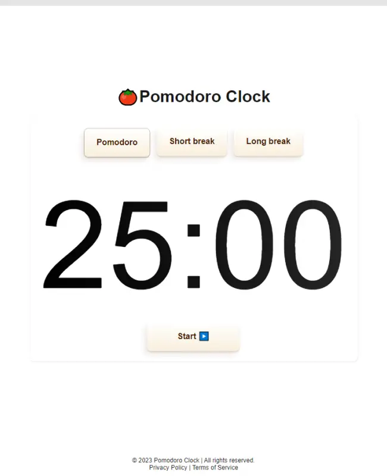

# Pomodoro Clock

This is a simple timer application inspired by the Pomodoro Technique, designed to help you stay focused and productive.

## Table of Contents
- [Demo](#demo)
- [Features](#features)
- [Technologies](#technologies)
- [Installation](#installation)
- [Usage](#usage)
- [Contributing](#contributing)
- [License](#license)

## Demo
You can check out the Pomodoro Clock in action <a href="http://jonatantech.github.io/pomodoro-clock/" target="_blank" rel="noreferrer">here.</a>

## Features
- **Pomodoro Timer**: Set work and break intervals for effective time management.
- **Audio Alerts**: Get audible notifications when a session ends.
- **Responsive**: Works on both desktop and mobile devices.

## Technologies
- HTML5
- CSS3
- JavaScript

## Installation
1. Clone this repository to your local machine.

2. Open the `index.html` file in your web browser to start using the Pomodoro Clock.

## Usage
1. Set your desired work and break durations.
2. Click the "Start" button to begin a Pomodoro session.
3. The timer will count down, and you'll hear a notification when the session ends.
4. Take a break, or start another session by clicking "Start" again.

## Contributing
Feel free to contribute to the project by opening issues or submitting pull requests. Your contributions are welcomed and appreciated!

## License
This project is licensed under the MIT License.
